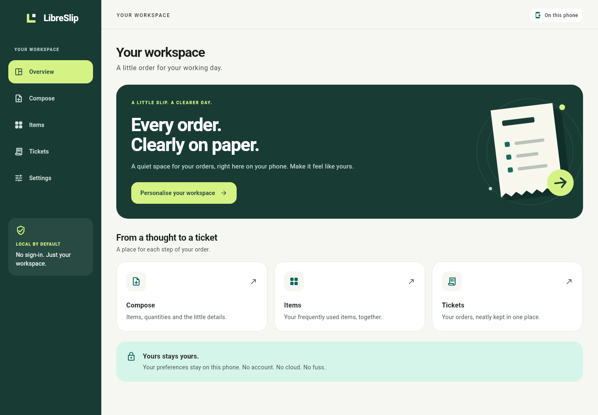

# LibreSlip

A private, local order-ticket printing app for Android 14 and later, built with Flutter. No login, cloud service or runtime internet requirement. Application identifier: `io.thelicato.libreslip`.



## Current milestone

Task 2 provides the Flutter foundation: responsive navigation, original branding, light/dark/system themes, British English and Italian, and locally persisted ticket heading, language and appearance. Settings include validation and storage error recovery. Automatic cloud backup is disabled.

Compose, Items and Tickets are clearly labelled previews. Item editing, order creation/history, printing and in-app ZIP import/export are not implemented yet. The required printer is the NETUM NT-1809DD; physical compatibility testing belongs to the printing milestone.

LibreSlip is for order tickets containing items, quantities and notes. It does not handle payments, prices, checkout or financial records.

## Downloads

The milestone artefacts are generated in `dist/`:

- `LibreSlip-task-02-foundation.zip`: complete milestone source, documentation and screenshots.
- `LibreSlip-task-02-preview.apk`: installable Android 14+ preview, signed with a development key.
- `LibreSlip-task-02-SHA256SUMS.txt`: integrity checksums for both files.

The source ZIP is separate from the planned in-app configuration and backup archives. This milestone is a visual foundation, not a working ticket printer.

## Develop

Use Flutter 3.47.2 and Dart 3.13.2 with the Android toolchain. See [development instructions](docs/development.md) for setup, builds, tests, architecture and packaging.

```sh
flutter pub get
flutter run
```

## Project documents

- [Requirements and agent instructions](AGENTS.md)
- [Delivery plan](docs/roadmap.md)
- [Hardware requirements](docs/hardware.md)
- [Development instructions](docs/development.md)
- [Validation results](docs/validation.md)
- [Phone preview](docs/previews/phone-en.png)
- [Italian dark-theme settings](docs/previews/settings-it-dark.png)

Development stops after each coherent atomic task and supplies a conventional commit name. The next task is reusable items, persistent order drafts and ticket history.
