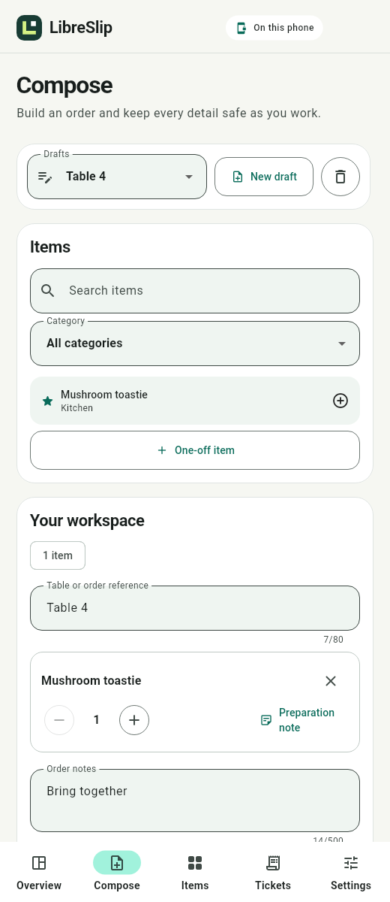

# LibreSlip

A private, local order-ticket app for Android 14 and later, built with Flutter. No login, cloud service or runtime internet requirement. Application identifier: `io.thelicato.libreslip`.



## Current milestone

Task 3 provides reusable item management and persistent order tickets. Items support categories, favourites, search and optional app-private images. Multiple drafts preserve reusable or one-off items, integer quantities, line preparation notes, order notes and optional table or order references. Saving creates an immutable ticket snapshot with a stable local number, and history can reopen that snapshot or duplicate it into a new editable draft.

Items, drafts and ticket history use a versioned transactional SQLite database. Draft-to-ticket conversion is atomic and idempotent, so retrying the same conversion cannot create a second ticket. Catalogue edits or removal do not rewrite saved ticket content.

Printing, printer setup, PDF sharing and in-app ZIP portability are not implemented. Saving a ticket does not print it and does not create a sale or financial transaction. Physical compatibility with the NETUM NT-1809DD remains untested.

## Downloads

The milestone artefacts are generated in `dist/`:

- `LibreSlip-task-03-items-tickets.zip`: complete milestone source, documentation and reviewed screenshots.
- `LibreSlip-task-03-preview.apk`: installable Android 14+ preview, signed with a development key.
- `LibreSlip-task-03-SHA256SUMS.txt`: integrity checksums for both files.

The source ZIP is separate from the planned in-app configuration and backup archives. The preview supports local item and ticket workflows but is not yet a ticket printer.

## Develop

Use Flutter 3.47.2 and Dart 3.13.2 with the Android toolchain. See [development instructions](docs/development.md) for setup, architecture, builds, tests and packaging.

```sh
flutter pub get
flutter run
```

## Project documents

- [Requirements and agent instructions](AGENTS.md)
- [Delivery plan](docs/roadmap.md)
- [Hardware requirements](docs/hardware.md)
- [Development instructions](docs/development.md)
- [Validation results](docs/validation.md)
- [Compose preview](docs/previews/compose-phone-en.png)
- [Italian item shelf](docs/previews/items-tablet-it.png)
- [Ticket history preview](docs/previews/tickets-tablet-en.png)

Development stops after each coherent task and supplies a conventional commit name. The next task is 58 mm ticket layout and NETUM printing.
