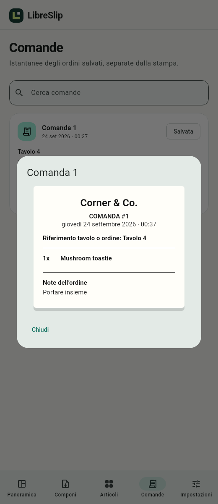

# LibreSlip

LibreSlip is a private order-ticket app for Android 14 and later. Build an order from reusable items, print it on a 58 mm Bluetooth printer and keep an immutable local history. LibreSlip has no login, subscription, payment processing or mandatory cloud service.

## What LibreSlip does

- Organises reusable items with categories, optional images and search.
- Builds tickets with quantities, preparation notes, order notes and an optional table or order reference.
- Keeps the current composition safe across restarts.
- Prints through Bluetooth Classic SPP to the NETUM NT-1809DD and shares ticket PDFs through Android.
- Saves ticket snapshots and print attempts without rewriting history when catalogue items change.
- Shows date-filtered ticket, quantity and per-item totals without prices or financial data.
- Exports configuration ZIPs and complete local backups with validated, recoverable restore.
- Works in British English and Italian with light, dark and system appearance settings.

## Client mode

Client mode is the normal offline workspace. Add items, compose tickets, connect a paired printer, print, review history and manage backups entirely on the phone. A connected printer is required before creating a new print attempt or explicitly reprinting a ticket.

An optional LibreSlip Server can receive immutable order copies over the local Wi-Fi network. Local composition, printing and history continue when no Server is paired or reachable. Items marked Local only stay on the complete local ticket and are omitted from Server delivery.

## Server mode

Server mode turns another Android device into a focused incoming-order board. The Orders tab shows Received and Completed orders, order details and the quantities still waiting to be prepared. Mark Done is the only order action. The Settings tab shows listener status, local addresses, certificate fingerprint, pairing controls, app mode and the installed LibreSlip version.

The Server listens on HTTPS port 5119 only while LibreSlip is open in Server mode. Pairing is explicit and uses the displayed local address, certificate fingerprint and five-minute code. Server mode does not edit the catalogue, compose or print tickets, or process financial information.

## Printer and status

LibreSlip supports the NETUM NT-1809DD over Android Bluetooth Classic SPP. Pair the printer in Android first, then select and connect it from LibreSlip Settings. The Overview reports LibreSlip's active connection state. The printer protocol does not expose a reliable battery percentage, so check the physical battery indicator when no percentage is shown.

A Transmitted result means Android finished writing the bytes. Always check the paper because the printer does not confirm physical output. LibreSlip never automatically repeats an uncertain print.

## Privacy and local data

Settings, items, the current composition, ticket history, print jobs and images stay in app-private storage. Automatic Android cloud backup and device transfer are disabled. LibreSlip contains no analytics, background upload or remote font dependency. Optional Client and Server traffic remains on the configured local network and uses pinned HTTPS authentication.

Exported backups can contain private ticket content. Store them securely. Pairing tokens, private keys and Bluetooth credentials are excluded from exports and backups.

## Install and update

Install the APK from a trusted LibreSlip release. Android 14 or later is required. Android only accepts an update signed by the same certificate as the installed copy, so development-signed previews are not a production upgrade baseline.

The installed version appears at the bottom of Settings in both Client and Server modes. Release versions come from the repository `VERSION` file and are changed manually by the release owner.

## Documentation

- [Hardware compatibility](docs/hardware.md)
- [Client and Server modes](docs/client-server-plan.md)
- [Archive format](docs/archive-format.md)
- [Local order protocol](docs/network-protocol.md)
- [Validation evidence](docs/validation.md)
- [Development and release instructions](docs/development.md)
